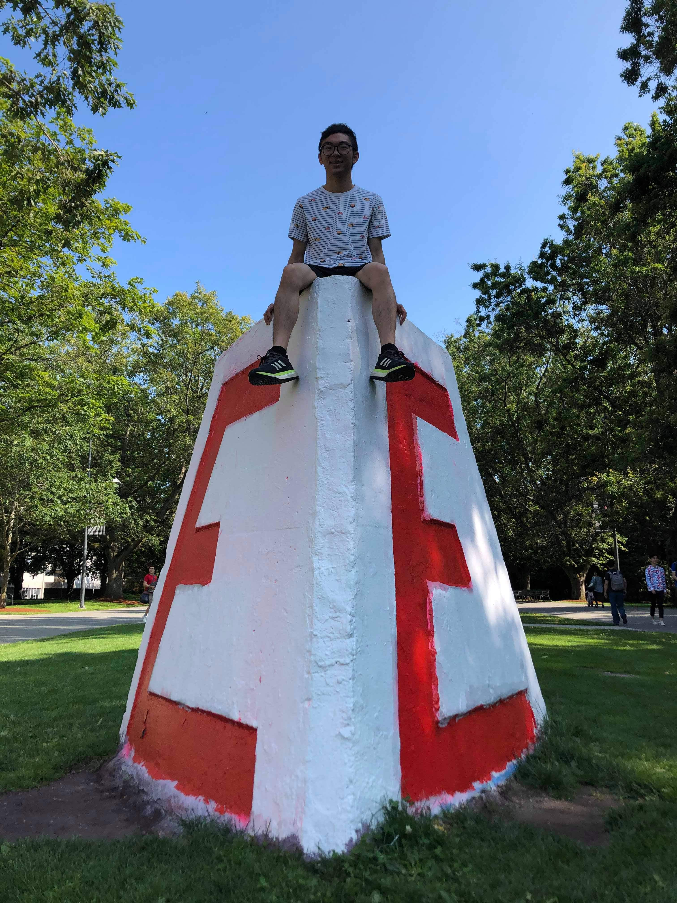

{: .mx-auto.d-block :}

Hi there! My name is **Charles Lee**, a current 3rd year [*Engineering Physics*](https://www.engphys.ubc.ca/) student at the University of British Columbia. My degree consists of a lot of math and physics on top of fundamental classes in electrical, mechanical, and some software engineering. I am hoping to apply that through a career in tech entrepreneurship and innovate to help others.

My previous experiences include work with embedded systems, robotics, software automation, and electrical test and measurement equipments. I have some experience with software virtualization and machine learning (I will be taking a project course in ML this term!), and I'm also currently on a [nanosatellite student engineering team](https://www.ubcorbit.com/) that will be launching a CubeSat in Winter 2021!

My short-term career goal is to gain exposure to a variety of fields through internships (currently seeking opportunities in Canada or Taiwan for summer 2021). I'm open to any electrical, firmware, software, or project management related position that fits my current qualifications, which you can read more about in my [resume](https://drive.google.com/file/d/1ac6JAA6wqIa_JsWMXTWUN4yAuLPRaOEF/view?usp=sharing).

In my (very occasional) free time, I enjoy playing video games, cooking/exploring other cuisines, and travelling. I've also recently started dabbling in more creative endeavours like singing (check out my [SoundCloud](https://soundcloud.com/charles-lee-178054525/10000-hours-enph-253-edition)) and digital art.